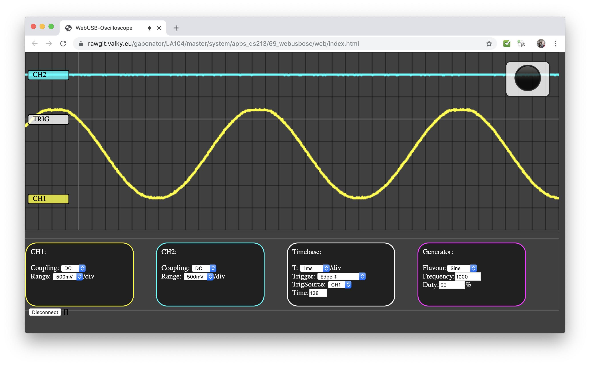
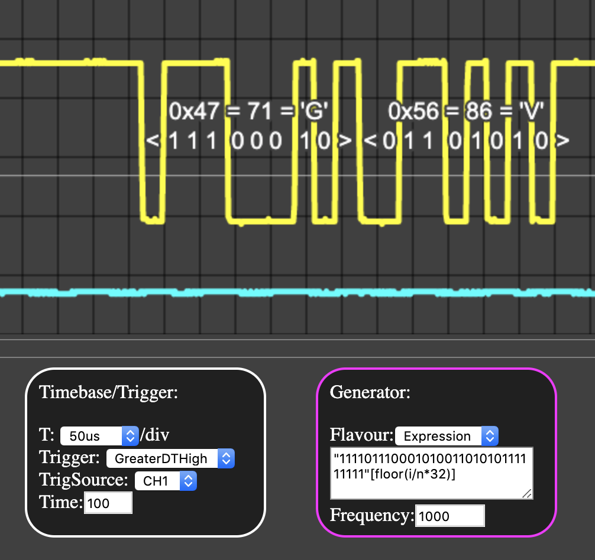
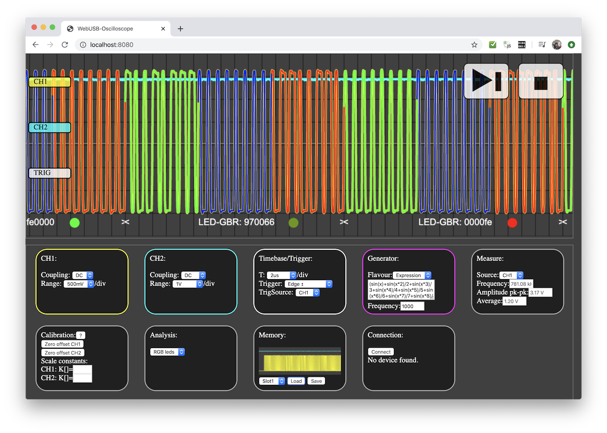

# Web USB Oscilloscope (DS203)

Proud to announce the first oscilloscope in the world using the WebUsb technology (correct me if I am wrong)! Read about the webusb technology and the evolution of connection between [microcontroller and web browser](https://github.com/gabonator/Education/blob/master/2019/WebUsb/readme.md). Just run the 69webusb.elf, connect the USB cable and click on system notification to open the oscilloscope interface. No application installation is required. Prebuilt binaries can be found here: [release 2019.12](https://github.com/gabonator/LA104/releases/tag/2019.12)

How to install:

  - First you need to flash new firmware to your DS203: keep pressed first button when powering the device on, copy the "ds203.hex" into the DFU drive. When the file was successfully flashed, it will be renamed to "ds203.rdy"
  - If you have problem copying new firmware, use Windows PC for copying (or virtual machine).
  - If the copying fails in the middle (if the version of DFU is V3.11C), downgrade to DFU V3.10 using [stm32flash utility](tools/stm32flash), you will need to open your device and solder few wires into the CN6 connector
  - When the firmware is run for the first time, it will ask for "shell.elf", copy all the elf files from [release 2019.12](https://github.com/gabonator/LA104/releases/tag/2019.12) to your device, and turn off/on
  - If the firmware is stuck and the last thing you see is "Image loaded at 0x........", you will need to rebuild the application for different address (contact me)
  - When the webusb application is running on DS203, it will ask you to connect it with your computer, a popup window should appear and after clicking on in, web application will be opened. If it is not, open following address: [https://l.valky.eu/webusbds2031](https://l.valky.eu/webusbds2031)
  - For linux users: If the web application cannot communicate with your DS203 ("Unable to claim interface in developer console" in Chrome developer console), run `sudo rmmod cdc_acm`
  - For windows users: You will need a device driver for your computer to be able to communicate with DS203. Generate WinUSB driver for the DS203 using this tool [https://zadig.akeo.ie/](https://zadig.akeo.ie/)

Video:

Features:

  - Fast realtime view of analog signals
  - Full control over trigger/timebase/analog input channel settings
  - Drag the signal label/trigger level to alter the signal position
  - Basic signal statistics (frequency, amplitude, average value)
  - Signal generator with predefined signal shapes (Square with duty cycle, sine, saw, triangle, DC, js/algebraic expression)
  - DC generator for calibration of analog channels (0.3V .. 2.7V)
  - Semi automatic calibration
  - Expression evaluator for signal generator (set your own formula, ability to generate UART signals)
    - *i* - sample index, *n* - count of samples, *x* - angle 0..2pi
    - `i/n*2-1` - sawtooth signal
    - `(sin(x)+sin(x*2)/2+sin(x*3)/3+sin(x*4)/4+sin(x*5)/5)*0.5` - first harmonics of sawtooth signal 
    - `(0b111111110000000010101010 >> Math.floor(24-i/n*24))&1` - for testing timed triggers (GreaterDTHigh, Time=100)
    - `(0b11101110001011111111111111111111 >>> Math.floor(32-i/n*32))&1` - generates uart signal for letter 'G'
    - `"11110111000101001101010111111111"[floor(i/n*32)]` - generates uart signal for letters 'GV'
  - UART decoder - shows stream bits, and decoded values in hexadecimal and decimal form and as ascii characters
  - Memory slots - store and restore your waveform and channel settings, including preview

UART Decoder and arbitrary signal generator:

Addressable led decoder with visualization:

